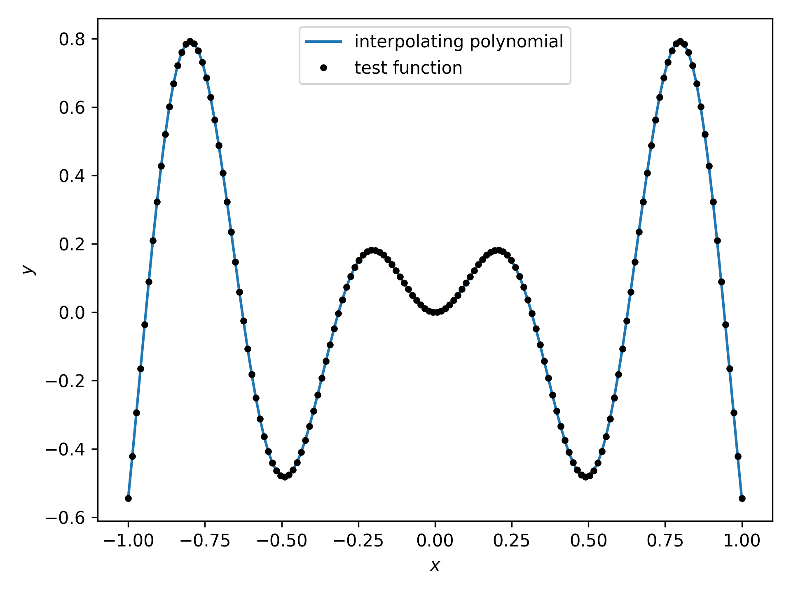
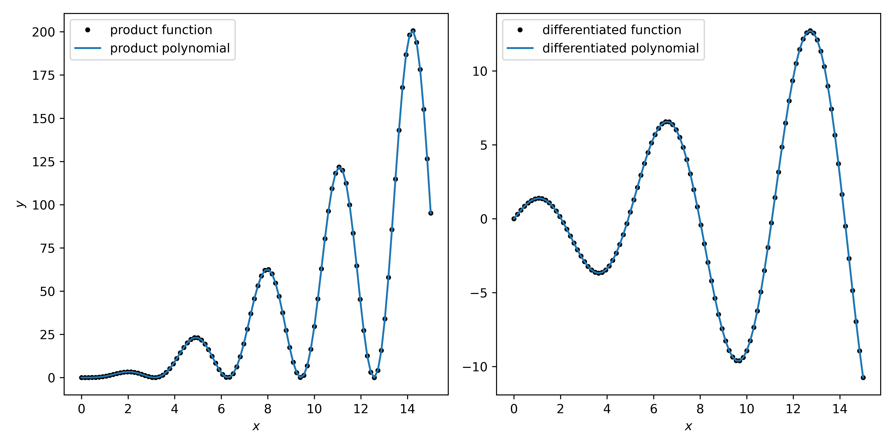

[](https://rodare.hzdr.de/record/3725)
[](https://joss.theoj.org/papers/96208a133980e518cdfdc36abdc504de)
[![Code style: black][black-badge]][black-link]
[](https://choosealicense.com/licenses/mit/)
[](https://pypi.org/project/minterpy/)

# Minterpy: Multivariate Polynomial Interpolation in Python

|                                 Branches                                  | Status                                                                                                                                                                                                                                                                                                                                                                                                                                                                                                                                                               |
| :-----------------------------------------------------------------------: |----------------------------------------------------------------------------------------------------------------------------------------------------------------------------------------------------------------------------------------------------------------------------------------------------------------------------------------------------------------------------------------------------------------------------------------------------------------------------------------------------------------------------------------------------------------------|
| [`main`](https://github.com/minterpy-project/minterpy/tree/main) (stable) | [](https://github.com/minterpy-project/minterpy/actions/workflows/build.yaml?query=branch%3Amain+) [](https://codecov.io/gh/minterpy-project/minterpy) [](https://minterpy-project.github.io/minterpy/stable/) |
|  [`dev`](https://github.com/minterpy-project/minterpy/tree/dev) (latest)  | [](https://github.com/minterpy-project/minterpy/actions/workflows/build.yaml?query=branch%3Adev) [](https://codecov.io/gh/minterpy-project/minterpy) [](https://minterpy-project.github.io/minterpy/latest/)                 |

Minterpy is an open-source Python package designed for constructing
and manipulating multivariate interpolating polynomials
with the goal of addressing the curse of dimensionality
from interpolation tasks.

Minterpy is being continuously extended and improved,
with new functionalities added to address the computational bottlenecks
in accuracy, stability, and performance of multidimensional interpolation
tasks.

## Installation

You can install Minterpy from [PyPI](https://pypi.org/project/minterpy/)
or from [source](https://github.com/minterpy-project/minterpy).

### From PyPI

You can obtain the stable release of Minterpy directly
from [PyPI](https://pypi.org/project/minterpy/) using `pip`:

```bash
pip install minterpy
```

### From source

To install the latest development version of Minterpy,
you can clone the [GitHub repository](https://github.com/minterpy-project/minterpy):

```bash
git clone https://github.com/minterpy-project/minterpy
```

Then install Minterpy from the source directory:

```bash
pip install .[all,dev,docs]
```

For an editable installation, use the flag `-e`:

```bash
pip install -e .[all,dev,docs]
```

The options `[all,dev,docs]` refer to the requirements defined
in the `options.extras_require` section in `setup.cfg`.

### Virtual environments

We recommend installing Minterpy in a virtual environment.
Tools like [mamba], [conda], [venv], [virtualenv] or [pyenv-virtualenv]
can help you set one up.
See [CONTRIBUTING.md](./CONTRIBUTING.md) for details.

> **NOTE**: **Do not** use the command `python setup.py install`
> to install Minterpy, as `setup.py` may not be present in the future releases.

## Quickstart

Using Minterpy, you can interpolate a given function.
For instance, take the one-dimensional function $`f(x) = x \, \sin{(x)}`$
with $x \in [0, 15]$:

```python
import numpy as np

def func(x):
    return x * np.sin(x)
```

To interpolate the function, you can use the function `interpolate()`:

```python
import minterpy as mp

interpolant = mp.interpolate(func, spatial_dimension=1, poly_degree=64, bounds=[0, 15])
```

`interpolate()` takes as arguments the function to interpolate,
the number of dimensions (`spatial_dimension`),
the degree of the underlying polynomial interpolant (`poly_degree`),
and the bounds of the domain (`bounds`).
You may adjust the polynomial degree parameter to get higher accuracy.
The resulting `interpolant` is a Python callable,
which can be used as an approximation of `func`.

In this example, an interpolating polynomial of degree $64$ produces
an approximation of `func` to near machine precision:

```python
import matplotlib.pyplot as plt

xx = np.linspace(0, 15, 100)

plt.plot(xx, func(xx), "k.",label="function")
plt.plot(xx, interpolant(xx), label="interpolant")
plt.legend()
plt.show()
```



Minterpy's capabilities extend beyond function approximation;
by accessing the underlying interpolating polynomials,
you can carry out common numerical operations on the approximations
like multiplication and differentiation:

```python
# Extract the underlying Newton interpolating polynomial
nwt_poly = interpolant.to_newton()
# Multiply the polynomial -> results in another polynomial
prod_poly = nwt_poly * nwt_poly
# Differentiate the polynomial once -> results in another polynomial
diff_poly = nwt_poly.diff(1)
# Analytical derivative of the function
diff_func = lambda xx: np.sin(xx) + xx * np.cos(xx)

fig, axs = plt.subplots(1, 2, figsize=(10, 5))

axs[0].plot(xx, func(xx)**2, "k.", label="product function")
axs[0].plot(xx, prod_poly(xx), label="product polynomial")
axs[0].legend()
axs[0].set_xlabel("$x$")
axs[0].set_ylabel("$y$")

axs[1].plot(xx, diff_func(xx), "k.", label="differentiated function")
axs[1].plot(xx, diff_poly(xx), label="differentiated polynomial")
axs[1].legend()
axs[1].set_xlabel("$x$")

plt.show()
```



The [Getting Started Guides](https://minterpy-project.github.io/minterpy/latest/getting-started/index.html#what-s-next)
provide more examples on approximating functions and performing operations
on interpolating polynomials, including multidimensional cases.

## Getting help

For detailed guidance,
please refer to the online documentation ([stable](https://minterpy-project.github.io/minterpy/stable/)
or [latest](https://minterpy-project.github.io/minterpy/latest/)).
It includes detailed installation instructions, usage examples, API references,
and contributors guide.

For any other questions related to the package,
feel free to post your questions on the GitHub repository
[Issue page](https://github.com/minterpy-project/minterpy/issues).

## Contributing to Minterpy

Contributions to Minterpy are welcome!

We recommend you have a look at the [CONTRIBUTING.md](./CONTRIBUTING.md) first.
For a more comprehensive guide visit
the [Contributors Guide](https://minterpy-project.github.io/minterpy/latest/contributors/index.html)
of the documentation.

## Citing Minterpy

If you use Minterpy in your research or projects, please cite our paper
published in the [Journal of Open Source Software](https://doi.org/10.21105/joss.07702):

```bibtex
@article{Wicaksono2025,
  author    = {Wicaksono, Damar and Acosta, Uwe Hernandez and Veettil, Sachin Krishnan Thekke and Kissinger, Jannik and Hecht, Michael},
  title     = {{Minterpy}: multivariate polynomial interpolation in {Python}},
  journal   = {Journal of Open Source Software},
  year      = {2025},
  volume    = {10},
  number    = {109},
  pages     = {7702},
  doi       = {10.21105/joss.07702},
  url       = {https://doi.org/10.21105/joss.07702}
}
```

For reproducibility, please also cite the specific version of Minterpy
that you used. The current archived version is available
on [RODARE](https://rodare.hzdr.de/record/3725):

```bibtex
@software{Minterpy_0_3_1,
  author       = {Hernandez Acosta, Uwe and Thekke Veettil, Sachin Krishnan and Wicaksono, Damar Canggih and Michelfeit, Jannik and Hecht, Michael},
  title        = {{Minterpy} - multivariate polynomial interpolation},
  month        = apr,
  year         = 2025,
  publisher    = {RODARE},
  version      = {v0.3.1},
  doi          = {10.14278/rodare.3725},
  url          = {https://doi.org/10.14278/rodare.3725}
}
```

## Credits and contributors

This work was partly funded by the Center for Advanced Systems Understanding ([CASUS]),
an institute of the Helmholtz-Zentrum Dresden-Rossendorf ([HZDR]),
financed by Germany’s Federal Ministry of Education and Research ([BMBF])
and by the Saxony Ministry for Science, Culture, and Tourism ([SMWK])
with tax funds on the basis of the budget approved
by the Saxony State Parliament.

### The Minterpy development team

Minterpy is currently developed and maintained by a small team
at the Center for Advanced Systems Understanding ([CASUS]):

- [Damar Wicaksono](https://orcid.org/0000-0001-8587-7730) ([HZDR]/[CASUS](https://www.casus.science/?page_id=4528))
- [Uwe Hernandez Acosta](https://orcid.org/0000-0002-6182-1481) ([HZDR]/[CASUS](https://www.casus.science/?page_id=4442))
- [Janina Schreiber](https://orcid.org/0000-0002-8692-0822) ([HZDR]/[CASUS](https://www.casus.science/?page_id=4528))

### Mathematical foundation

- [Michael Hecht](https://orcid.org/0000-0001-9214-8253) ([HZDR]/[CASUS](https://www.casus.science/?page_id=4528))

### Former members and contributors

- [Sachin Krishnan Thekke Veettil](https://orcid.org/0000-0003-4852-2839)
- [Jannik Kissinger](https://orcid.org/0000-0002-1819-6975)
- [Nico Hoffman](https://scholar.google.de/citations?user=8iDQeTwAAAAJ&hl=de)
- [Steve Schmerler](https://orcid.org/0000-0003-1354-0578) ([HZDR])
- Vidya Chandrashekar ([TU Dresden](https://tu-dresden.de/))

### Acknowledgements

- [Klaus Steiniger](https://orcid.org/0000-0001-8965-1149) ([HZDR]/[CASUS](https://www.casus.science/?page_id=4353))
- [Patrick Stiller](https://scholar.google.com/citations?user=nOtYbWMAAAAJ&hl=de) ([HZDR])
- Matthias Werner ([HZDR])
- [Krzysztof Gonciarz](https://orcid.org/0000-0001-9054-8341) ([MPI-CBG]/[CSBD])
- [Attila Cangi](https://orcid.org/0000-0001-9162-262X) ([HZDR]/[CASUS](https://www.casus.science/?page_id=4660))
- [Michael Bussmann](https://orcid.org/0000-0002-8258-3881) ([HZDR]/[CASUS](https://www.casus.science/?page_id=4353))

## License

Minterpy is released under the [MIT license](LICENSE).

[mamba]: https://mamba.readthedocs.io/en/latest/
[conda]: https://docs.conda.io/
[pip]: https://pip.pypa.io/en/stable/
[venv]: https://docs.python.org/3/tutorial/venv.html
[virtualenv]: https://virtualenv.pypa.io/en/latest/
[pyenv-virtualenv]: https://github.com/pyenv/pyenv-virtualenv
[virtualenv]: https://virtualenv.pypa.io/en/latest/index.html
[CASUS]: https://www.casus.science
[HZDR]: https://www.hzdr.de
[BMBF]: https://www.bmbf.de/
[SMWK]: https://www.smwk.sachsen.de/
[MPI-CBG]: https://www.mpi-cbg.de
[CSBD]: https://www.csbdresden.de
[black-badge]: https://img.shields.io/badge/code%20style-black-000000.svg
[black-link]: https://github.com/psf/black
