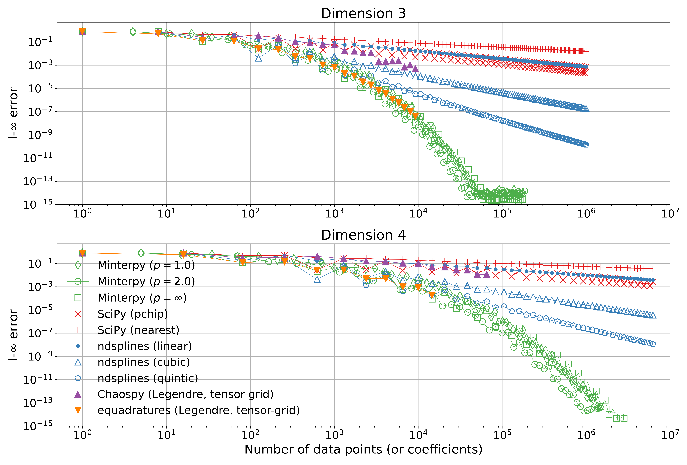

# Summary

Interpolation is the bottleneck in numerous computational tasks,
appearing in function approximation, curve fitting, numerical integration,
surface level-set methods, differential geometry,
spectral methods, surrogate-model-based optimization,
sensitivity analysis, uncertainty quantification,
and beyond.

Minterpy is an open-source Python package designed
for multivariate polynomial interpolation.
It provides a means of approximating a wide range of functions
using numerically stable and accurate interpolating polynomials.
Some of its key features are:

- Polynomial interpolation on properly selected nodes and
  polynomial regression on given arbitrary scattered nodes.
- Differentiation and integration operations on the polynomials.
- Addition, subtraction, and multiplication operations
  on the polynomials.

Minterpy's long-term vision is to provide researchers and engineers
a software solution that mitigates the curse of dimensionality
commonly associated with interpolation tasks.

# Statement of need

Polynomial interpolation can be traced back to the works of
Newton, Lagrange, and others [@Meijering2002],
and its significance in mathematics and computing is well-established
[@Cools2002;@Hecht2018;@Xiu2009].
As a means of approximating functions, global polynomials---where a single polynomial
is defined over the entire domain---offer several advantages
that facilitate common numerical operations, such as
differentiation, integration, addition, subtraction, or multiplication [@Trefethen2019].

Polynomial interpolation is based on the principle that, in one dimension,
one and only one polynomial $Q_{f, n}$ of degree $n$ can interpolate
a function $f: \Omega \mapsto \mathbb{R}$ in a bounded domain $\Omega$
with $n + 1$ distinct _unisolvent interpolation nodes (points)_ $P_n$ such that
$$
Q_{f, n} (p_i) = f(p_i),\; \forall p_i \in P_n \subset \Omega,\; i = 0, \ldots, n.
$$
The Stone-Weierstrass Approximation Theorem further states that,
in multiple dimensions, any continuous function on a bounded domain
can be approximated by multivariate global polynomials [@Branges1959].
The theorem, however, does not prescribe how to obtain such a polynomial.
Furthermore, the theorem does not even require the sequence of polynomials $Q_{f, n}$
to coincide with $f$ _anywhere_ in the domain,
while still having uniform convergence on the domain.
In short, approximation and interpolation
using global polynomials are two distinct problems that must be addressed simultaneously.

Global polynomials, although familiar in structure,
can achieve a better global accuracy for a wide class of regular functions
(differentiable, smooth, analytic),
and are amenable to further numerical computations,
have a controversial reputation due to misconceptions
that they are unstable, susceptible to Runge's phenomenon,
prone to round-off errors during evaluation,
and subject to the curse of dimensionality [@Trefethen2011;@Trefethen2017].

Minterpy addresses these issues
by constructing multivariate polynomial interpolants
in proper interpolation nodes,
and representing the polynomials in the Newton basis for stable evaluation.
Furthermore, the underlying multi-index sets of the multivariate polynomials
can be tailored to mitigate the curse of dimensionality.
While by no means a universal tool for function approximation,
Minterpy offers polynomials that can accurately and stably approximate
Lipschitz continuous functions,
with high algebraic convergence rates for common regular functions
up to geometric convergence rates for analytic functions [@Chkifa2013;@Trefethen2019].

There are numerous packages written in various programming languages
that provide polynomial-based function approximation.
Among them, Minterpy shares several similarities in both objectives
and functionality with Chebfun [@Driscoll2014].
Chebfun, a popular MATLAB package[^chebfun-ports], provides numerical
computations with functions using interpolating polynomials
(specifically, Chebyshev polynomials).
It offers a range of features, such as root finding, differentiation, and integration.
However, Chebfun is limited to approximating functions in one, two, and three dimensions.
By comparison, Minterpy extends interpolating polynomials to higher dimensions,
though its present feature set is more limited.

Within the Python community, several packages are available
for constructing polynomial-based function approximations.
Examples include Chaospy [@Feinberg2015], equadratures [@Seshadri2017],
PyGPC [@Weise2020], PyThia [@Hegemann2023], and UncertainSci [@Tate2023].
These packages are primarily based on the generalized polynomial
chaos expansion (i.e., orthogonal polynomials) [@Xiu2002]
and are used in the context of uncertainty quantification (UQ).
As a result, constructing a polynomial approximation using these packages
typically requires the problem to be first framed
as an uncertainty quantification problem,
where the inputs are modeled probabilistically.
Minterpy, on the other hand, offers a more straightforward approach to
polynomial-based function approximation free from UQ context.

Finally, several Python packages are available for constructing polynomial-based
approximation from a given data.
SciPy [@Virtanen2020], for instance,
offers various multivariate interpolation methods
(e.g., linear, nearest, pchip[^pchip]) designed for data on rectilinear grids
(rectangular grid with even or uneven spacing).
Recently, the package ndsplines was introduced [@Margolis2019],
providing an efficient implementation of tensor-product multivariate B-splines.
In contrast to Minterpy, these packages build piecewise local polynomials
and their high-level interfaces are designed
to handle a given set of input/output pairs,
following a data-driven approach.
Due to their familiarity and widespread use,
piecewise polynomials, such as splines,
are established tools for constructing interpolating polynomials.

# Package overview

Consider an $m$-dimensional continuous function $f: \square^m \mapsto \mathbb{R}$
defined, from now on, on the multidimensional hypercube.
Minterpy constructs an interpolating polynomial of such a function
via a polynomial expansion in the Lagrange basis
\begin{equation}
\label{eq:interpolating-polynomial}
f (\boldsymbol{x}) \approx Q (\boldsymbol{x}) = \sum_{\boldsymbol{\alpha} \in A} f(\boldsymbol{p}_{\boldsymbol{\alpha}}) \, L_{\boldsymbol{\alpha}} (\boldsymbol{x}),
\end{equation}
where $A \subseteq \mathbb{N}^m$ is the multi-index set, and
$L_{\boldsymbol{\alpha}}$ and $\boldsymbol{p}_{\boldsymbol{\alpha}}$
are the Lagrange basis polynomial and the unisolvent node
that correspond to the index element $\boldsymbol{\alpha}$, respectively.
The set of unisolvent nodes
$\{ \boldsymbol{p}_{\boldsymbol{\alpha}} \}_{\boldsymbol{\alpha} \in A}$
constitutes the interpolation grid.

Each Lagrange basis polynomial $L_{\boldsymbol{\alpha}}$ satisfies the condition
$$
L_{\boldsymbol{\alpha}} (p_{\boldsymbol{\beta}}) = \delta_{\boldsymbol{\alpha}, \boldsymbol{\beta}},\;\; p_{\boldsymbol{\beta}} \in \{ \boldsymbol{p}_{\boldsymbol{\alpha}} \}_{\boldsymbol{\alpha} \in A},\;\; \boldsymbol{\alpha} \in A
$$
where $\delta_{\cdot, \cdot}$ is the Kronecker delta.
Through this condition, the polynomial given in \autoref{eq:interpolating-polynomial}
is indeed an interpolating polynomial.

The cardinality of the multi-index set $A$ determines
the number of coefficients of the polynomial,
the number of unisolvent nodes,
and ultimately, the number of required function evaluations.
Users can create their own multi-index sets,
but Minterpy, by default, constructs a complete downward-closed
multi-index set $A_{m, n, p}$
with spatial dimension $m \in \mathbb{N}_{> 0}$,
polynomial degree $n \in \mathbb{N}$,
and $l_p$-degree $p \in \mathbb{R}_{> 0}$,
meaning $A = A_{m, n, p}$ with
$$
A_{m, n, p} = \{ \boldsymbol{\alpha} \in \mathbb{N}^m: \lVert \boldsymbol{\alpha} \rVert_p = (\alpha_1^p + \cdots + \alpha_m^p)^{1/p} \leq n \}.
$$
The common choices for $p$ are $1.0$ (total degree),
$2.0$ (Euclidean degree),
and $\infty$ (tensor product).
The Euclidean degree, in particular,
demonstrates a greater resistance to the curse of dimensionality
[@Trefethen2017a;@Hecht2020].

Given that the coefficients of the Lagrange expansion are
equal to the function values at the unisolvent nodes,
the Lagrange basis offers an intuitive method for function approximation.
However, deriving closed-form expressions for the multidimensional
Lagrange basis polynomials can be challenging
for general non-tensor-product interpolation grids.
To perform further operations with the polynomial, such as evaluation
and differentiation,
Minterpy transforms the polynomial into the Newton basis
$$
Q (\boldsymbol{x}) = \sum_{\boldsymbol{\alpha} \in A} c_{\boldsymbol{\alpha}} \, N_{\boldsymbol{\alpha}} (\boldsymbol{x}),\;\; N_{\boldsymbol{\alpha}} (\boldsymbol{x}) = \prod_{i = 1}^m \prod_{j = 0}^{\alpha_i - 1} (x_i - q_j),\;\; q_j \in P_i,
$$
where $c_{\boldsymbol{\alpha}}$ and $N_{\boldsymbol{\alpha}}$ are
the Newton coefficient and Newton polynomial
that correspond to the index element $\boldsymbol{\alpha}$, respectively;
and $P_i$ is a set of interpolation nodes in each dimension.
By default, Minterpy generates these points using
the Leja-ordered Chebyshev-Lobatto points.
The computation of the Newton coefficients, based on
the Lagrange coefficients and interpolation grid,
is a key step in Minterpy.
This process is carried out by the multidimensional divided difference scheme (DDS)
[@Hecht2020].

Note that while the Newton basis is the preferred polynomial basis
in Minterpy, Minterpy also supports other bases, such as the canonical (monomial)
and the Chebyshev (of the first kind) basis.
Polynomials expressed in one basis may be transformed into another basis.
The canonical basis, for example, presents polynomials most familiarly,
although its evaluation is inherently unstable, especially
for high polynomial degrees.

## Minterpy polynomials for function approximation

Minterpy's objective is first and foremost function approximation;
its polynomials must therefore be stable and accurate even in high degrees.
Consider, the Runge function:
$$
f(\boldsymbol{x}) = \frac{1}{1 + \lVert \boldsymbol{x} \rVert^2},\; \boldsymbol{x} \in [-1, 1]^m,
$$
a function commonly used to illustrate Runge's phenomenon,
a frequently cited pitfall when employing high-degree global polynomial interpolation
with equispaced points.

\autoref{fig:convergence} shows the accuracy of Minterpy interpolating polynomials
for three different $l_p$-degrees in dimension $m = 3, 4$.
As the increase of polynomial degree is directly related to the growing number of coefficients
(and equivalently, function evaluations),
the number of coefficients or data points is shown in the horizontal axis to facilitate
comparison with other methods.
The infinity norm of the difference between the original function
and its approximation
$$
\lVert f - Q_f \rVert_{\infty} = \max_{x \in \square^m} \lvert f - Q_f \rvert
$$
is measured in $1'000'000$ random points.

For comparison, the figure also displays the results
from data-driven methods from SciPy (v1.13.1) and ndsplines (v0.2.0),
along with the pseudo-spectral projection methods
from Chaospy (v.4.3.17) and Equadratures (v10).

In the data-driven methods,
the complexity of the approximations is fixed while increasingly more data is provided.
Although ndsplines supports degrees higher than those shown,
spline of degree beyond $5$ is uncommon in practical applications.

In the pseudo-spectral methods,
the approximation is based on the Legendre polynomial expansion in tensor-product grids
with the corresponding coefficients computed using numerical integration
(hence, pseudo-spectral). The number of coefficients, therefore, is equivalent to
Minterpy interpolants with an $l_\infty$-degree.
equadratures, whose convergence results are equivalent to Minterpy with an $l_\infty$-degree,
imposes a soft limit on the cardinality of the multi-index set to $5 \times 10^4$
beyond which the computation of the coefficients becomes prohibitively expensive.
Chaospy, on the other hand, appears to encounter difficulties
with the expansion in tensor-product grids[^sparse].

The results demonstrate that Minterpy polynomials offer an accurate function approximation,
outperforming other common polynomial-based approximation methods in Python.
Specifically, Minterpy polynomials remain stable and achieve numerical convergence
with an accuracy of $10^{-14}$.

## Operations on the Minterpy polynomials

Once a Minterpy polynomial is obtained,
it can be further processed through basic arithmetic[^rational-function] and calculus operations.
Basic arithmetic operations include addition, subtraction, multiplication,
and exponentiation by positive integers.
Since polynomials are closed under these operations,
Minterpy produces another Minterpy polynomial instance as the result of the operation.
Only Chaospy provides such capabilities in the compared tools.

Moreover, Minterpy supports basic calculus operations for polynomials
including differentiation and definite integration.
Differentiating a polynomial yields another polynomial instance that represents
the derivative of the original polynomial.
Definite integration, on the other hand, results in numerical value.

## Polynomial regression

While Minterpy interpolation rests on Leja-ordered Chebyshev-Lobatto nodes,
real-world datasets often consist of function values at scattered or
equispaced points within the domain.
To address such cases, Minterpy supports the construction of a polynomial[^non-interpolatory]
through well-conditioned least-squares
schemes [@Veettil2022].

Once constructed, the polynomial can be further processed
like any other Minterpy polynomial.

## Documentation

The online documentation is a crucial component of the Minterpy project.
Adopting the Diátaxis framework [@Procida2024],
the documentation is roughly divided into four main categories:
Getting Started (a quick start guide and a series of in-depth tutorials),
How-To Guides (instructions on how to accomplish a specific task),
Fundamentals (explanations of the mathematical theory that underlies Minterpy),
and API reference (detailed descriptions of the functions and classes in the API).
A dedicated section on contributing to the Minterpy project is also available.

The package documentation can be found on the Minterpy [readthedocs]()

## Applications

Minterpy has been applied in various fields of research within the open literature,
including for data fitting in physics [@Dornheim2023],
serving as a surrogate model in blackbox optimization [@Schreiber2023],
and representing level sets in differential geometry [@Veettil2023].

## Further developments

Minterpy is continuously being extended and improved.
One ongoing effort, for instance, aims to leverage
the unique nested and sparse triangular structure
of the transformation matrix used in the Lagrange-to-Newton
and Newton-to-Lagrange transformations
to achieve more efficient storage and faster computations.
Additionally, work is underway to develop an automatic, adaptive,
and sparse construction scheme for interpolating polynomials.

## Author contributions

The contributions to this paper are listed according
to the CRediT (Contributor Roles Taxonomy).
**Damar Wicaksono**: Conceptualization, software, validation, visualization, and writing--original draft.
**Uwe Hernandez Acosta**: Conceptualization, project administration, software, and writing--review and editing.
**Sachin Krishnan Thekke Veettil**: Conceptualization and software.
**Jannik Michelfeit**: Conceptualization and software.
**Michael Hecht**: Conceptualization, supervision, funding acquisition, and writing--review and editing.

## Acknowledgments

The authors sincerely thank Janina Schreiber for
the thorough and insightful code review during the development process.

The work is partly funded by the Center for Advanced Systems Understanding ([CASUS](https://www.casus.science))
which is financed by Germany's Federal Ministry of Education and Research (BMBF)
and by the Saxony Ministry for Science, Culture and Tourism (SMWK).
Funding is provided through taxfunds based on the budget approved the Saxony State Parliament.

# References

[^chebfun-ports]: Packages in other languages based on or similar to Chebfun
include ApproxFun [@Olver2023] in Julia,
and ChebPy [@Richardson2024] and pychebfun [@Swierczewski2024] in Python.
[^rational-function]: Minterpy currently does not support polynomial-polynomial division.
[^sparse]: Both Chaospy and equadratures support sparse polynomial construction,
which may alleviate the issue of large number of coefficients.
Comparing these approaches, however, is beyond the scope of this work.
[^pchip]: pchip stands for Piecewise cubic Hermite interpolating polynomial.
[^non-interpolatory]: The polynomials are, however, not strictly interpolatory.
