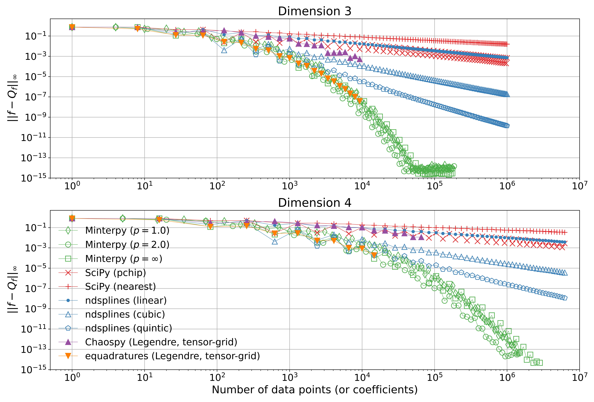

# Summary

Interpolation is essential in various computational tasks,
including function approximation, curve fitting, numerical integration,
differential geometry,
spectral methods, optimization,
and uncertainty quantification.

Minterpy is an open-source Python package designed
for multivariate polynomial interpolation.
It provides stable and accurate interpolating polynomials for approximating a wide range of functions.
Key features include:

- Polynomial interpolation on properly selected nodes and
  regression on arbitrary nodes.
- Differentiation and integration operations on the polynomials.
- Addition, subtraction, and multiplication operations
  on the polynomials.

Minterpy's long-term vision is to provide researchers and engineers
a software solution that mitigates the curse of dimensionality
commonly associated with interpolation tasks.

# Statement of need

As a means of approximating functions, global polynomials---where a single
polynomial is defined over the entire domain---offer several advantages.
For sufficiently smooth functions, global polynomials can achieve
high accuracy with a smaller number of data points (sampled over the entire domain)
compared to local piecewise polynomials.
Additionally, their relatively simple structure facilitates
many common numerical operations.
These operations include differentiation, integration, addition, subtraction,
and multiplication [@Trefethen2019].

The Stone-Weierstrass theorem establishes that any continuous function
on a bounded domain in multiple dimensions can be approximated uniformly
to arbitrary precision by multivariate global polynomials [@Branges1959].
However, the theorem does not specify a concrete method for constructing
such approximating polynomials.
Various techniques can be employed to build approximating polynomials,
such as least square approximations.
Minterpy focuses on constructing approximating global polynomials using
one of the earliest and most established methods: interpolation [@Goldstine1977].

Polynomial interpolation is based on the principle that, in one dimension,
there exists a unique polynomial $Q_{f, n}$ of degree $n$ that interpolates
a function $f: \Omega \to \mathbb{R}$ in a bounded domain
$\Omega$ with $n + 1$ _distinct (unisolvent[^unisolvent]) interpolation nodes
(or points)_ $P_n$ such that
\begin{equation}
\label{eq:interpolation-condition}
Q_{f, n} (p_i) = f(p_i),\; \forall p_i \in P_n \subset \Omega,\; i = 0, \ldots, n.
\end{equation}
Polynomial interpolation has its roots in the works of Newton, Euler, Lagrange,
and others [@Meijering2002], and its significance in mathematics and computing
is well-established [@Cools2002;@Xiu2009].  

Despite their aforementioned advantages as global polynomials,
global interpolating polynomials have a controversial reputation due to
several misconceptions [@Trefethen2011;@Trefethen2016;@Trefethen2017]:  

- They are often thought to be prone to Runge's phenomenon,
  whereby increasing the degree of interpolating polynomials worsens
  the approximation quality.
- Their evaluation is frequently believed to be numerically unstable
  and susceptible to round-off errors.
- Their extension to multiple dimensions is seen as severely limited
  by the curse of dimensionality, particularly when using tensor product
  constructions, which causes the required number of interpolation nodes
  (i.e., data points) to grow exponentially with the number of spatial dimensions.
- They are said to generally fail to converge to the approximated function
  as the degree increases, with Faber's theorem often cited
  to justify this assertion.
  This view has contributed to a more generally pessimistic outlook
  on the use of interpolating polynomials for function approximation.

Minterpy addresses these issues by:

- Constructing multivariate interpolating polynomials using
  appropriate interpolation nodes (e.g., Chebyshev-Lobatto nodes)
  to help mitigate Runge's phenomenon[^equispaced];
- Representing the interpolating polynomials in the Newton basis,
  combined with Leja ordering of the interpolation nodes
  to ensure stable evaluation [@Reichel1990;@TalEzer1991;@Breuss2018];
- Using a multi-index set to represent the multivariate polynomials,
  which can be tailored to mitigate the curse of dimensionality
  while preserving the approximation power of the interpolating polynomials
  (more on this in the next section).

While Faber's theorem shows that no _interpolating polynomial_ can converge
for _all_ continuous functions, it has been demonstrated that if the function
is reasonably smooth, the interpolating polynomials do converge
at high algebraic rates for common regular (Lipschitz continuous[^lipschitz])
functions and at geometric rates for analytic functions [@Trefethen2017a].

Minterpy shares similar objectives and functionality with Chebfun [@Driscoll2014],
a popular MATLAB package[^chebfun-ports] designed for numerical computations
using interpolating polynomials, specifically Chebyshev polynomials.
Chebfun provides features such as root finding, differentiation, and integration
for function approximation in up to three dimensions.
In contrast, Minterpy supports higher dimensions but with fewer features.

Several Python packages, such as Chaospy [@Feinberg2015],
equadratures [@Seshadri2017], PyGPC [@Weise2020], PyThia [@Hegemann2023],
and UncertainSci [@Tate2023], provide polynomial-based function approximations,
primarily for uncertainty quantification (UQ) using generalized polynomial
chaos expansion [@Xiu2002].
These tools frame problems as UQ tasks, where inputs are modeled
probabilistically.
With few exceptions (notably Chaospy), the resulting polynomials are primarily
used for function approximations, accompanied by additional post-processing
utilities tailored to UQ tasks (e.g., uncertainty propagation,
sensitivity analysis).
In contrast, Minterpy offers a simpler, UQ-free approach to function approximation
using interpolating polynomials, with fewer barriers to entry, and includes
several mathematical operations on the polynomials.

Several other Python packages construct polynomial approximations from data.
SciPy [@Virtanen2020] provides multivariate interpolation methods
(e.g., linear, nearest, pchip[^pchip]) for rectilinear grids.
ndsplines [@Margolis2019] efficiently implements tensor-product multivariate
B-splines that can be differentiated and anti-differentiated.
Unlike Minterpy, these tools rely on piecewise local polynomials
and are tailored for input/output data pairs.
Familiar and widely used, piecewise polynomials---especially splines---remain
established tools for polynomial interpolation tasks.

In summary, while not a universal tool for all function approximation problems,
Minterpy offers a robust solution for approximating a wide range of multidimensional
Lipschitz continuous functions using accurate and stable polynomials.
Once obtained, these polynomials can be readily manipulated using standard
arithmetic operations, such as addition and multiplication,
as well as calculus operations, like differentiation and integration.
The significance of this capability extends beyond function approximation,
as many numerical methods (e.g., root finding, optimization) can be boiled down
to these fundamental operations on functions.
By leveraging Minterpy's polynomials,
users can conveniently carry out symbolic-like computations
that would normally require direct manipulation of function values.

# Package overview

Consider an $m$-dimensional function $f: \boldsymbol{\Omega} \subset \mathbb{R}^m \to \mathbb{R}$,
defined on a hypercube.
Minterpy interpolates the function using a polynomial expansion
in the Lagrange basis
\begin{equation}
\label{eq:interpolating-polynomial}
f (\boldsymbol{x}) \approx Q (\boldsymbol{x}) = \sum_{\boldsymbol{\alpha} \in A} f(\boldsymbol{p}_{\boldsymbol{\alpha}}) \, L_{\boldsymbol{\alpha}} (\boldsymbol{x}),
\end{equation}
where $A \subseteq \mathbb{N}^m$,
$L_{\boldsymbol{\alpha}}$, and $\boldsymbol{p}_{\boldsymbol{\alpha}}$
are the multi-index set,
the Lagrange basis polynomial,
and the unisolvent node that correspond to the index element $\boldsymbol{\alpha}$,
respectively.
The set $\{ \boldsymbol{p}_{\boldsymbol{\alpha}} \}_{\boldsymbol{\alpha} \in A}$
forms the interpolation grid.

Each basis polynomial satisfies the Kronecker delta condition
$$
L_{\boldsymbol{\alpha}} (p_{\boldsymbol{\beta}}) = \delta_{\boldsymbol{\alpha}, \boldsymbol{\beta}},\;\; p_{\boldsymbol{\beta}} \in \{ \boldsymbol{p}_{\boldsymbol{\alpha}} \}_{\boldsymbol{\alpha} \in A},\;\; \boldsymbol{\alpha} \in A,
$$
ensuring $Q(\boldsymbol{x})$ in \autoref{eq:interpolating-polynomial}
is an interpolating polynomial.

The multi-index set $A$ determines polynomial coefficients, unisolvent nodes,
and function evaluations.
In Minterpy, the default is a downward-closed set $A_{m, n, p}$
with spatial dimension $m \in \mathbb{N}_{> 0}$, 
polynomial degree $n \in \mathbb{N}$, and $\ell_p$-degree $p \in \mathbb{R}_{> 0}$.
The set is defined as
$$  
A_{m, n, p} = \{ \boldsymbol{\alpha} \in \mathbb{N}^m: \lVert \boldsymbol{\alpha} \rVert_p = (\alpha_1^p + \cdots + \alpha_m^p)^{1/p} \leq n \}.  
$$
Here, typical choices for $p$ are $1.0$, $2.0$, and $\infty$,
representing the total, Euclidean, and maximum degree (tensor-product),
respectively. These values for $p$ correspond to polynomial, sub-exponential,
and exponential growth of the set size as a function of the spatial dimension.
Consequently, the maximum degree set faces a severe curse of dimensionality
due to the rapid growth of the set size.

It has been shown that the Euclidean degree $p = 2.0$ offers the best compromise
for isotropic functions (where each variable has the same importance)[^anisotropy],
as its convergence rate matches that of $p = \infty$ with respect
to the polynomial degree, yet with a significantly smaller multi-index set.
In contrast, while the size of the multi-index set for $p = 2.0$
is larger than that for $p = 1.0$, the gain in accuracy more than compensates
for the increased cost [@Trefethen2017a;@Hecht2025].

Deriving multidimensional Lagrange bases for non-tensorial grids is challenging.
Minterpy uses the Newton basis for efficient evaluation and differentiation
$$
Q (\boldsymbol{x}) = \sum_{\boldsymbol{\alpha} \in A} c_{\boldsymbol{\alpha}} \, N_{\boldsymbol{\alpha}} (\boldsymbol{x}),\;\; N_{\boldsymbol{\alpha}} (\boldsymbol{x}) = \prod_{i = 1}^m \prod_{j = 0}^{\alpha_i - 1} (x_i - q_j),\;\; q_j \in P_i,
$$
where $c_{\boldsymbol{\alpha}}$ and $N_{\boldsymbol{\alpha}}$ are
the Newton coefficient and Newton polynomial
that correspond to the index element $\boldsymbol{\alpha}$, respectively;
$P_i$ is a set of interpolation nodes in each dimension.
Using Leja-ordered Chebyshev-Lobatto interpolation nodes by default,
Newton basis offers numerical stability [@Reichel1990;@TalEzer1991;@Breuss2018].
Computing Newton coefficients, based on the Lagrange coefficients and interpolation grid,
via a multidimensional divided-difference scheme (DDS) is a key step
in Minterpy [@Hecht2025].

Minterpy also supports other polynomial bases,
including the canonical (monomial) and Chebyshev (first kind) bases,
along with transformations between them.

## Minterpy polynomials for function approximation

Minterpy prioritizes stable and accurate function approximation through
polynomial interpolations, even for high-degree polynomials.
Consider, the Runge function:
$$
f(\boldsymbol{x}) = \frac{1}{1 + \lVert \boldsymbol{x} \rVert^2},\; \boldsymbol{x} \in [-1, 1]^m,
$$
commonly used to demonstrate Runge's phenomenon,
a pitfall in high-degree interpolation with equispaced points.

\autoref{fig:convergence} shows the accuracy of Minterpy interpolating polynomials
for three different $\ell_p$-degrees in dimension $m = 3, 4$[^machine].
The horizontal axis shows the number of coefficients (and function evaluations),
directly linked to the polynomial degree, to enable comparisons with other methods.
The infinity norm of the difference between the function and its approximation,
$$
\lVert f - Q_f \rVert_{\infty} = \max_{\boldsymbol{x} \in [-1, 1]^m} \lvert f(\boldsymbol{x}) - Q_f(\boldsymbol{x}) \rvert
$$
is measured at $1'000'000$ random points.

The figure compares data-driven methods (SciPy v1.13.1, ndsplines v0.2.0post0)
and pseudo-spectral methods (Chaospy v4.3.18, Equadratures v10).
In the data-driven methods, approximation complexity is fixed as data increases.
While ndsplines supports higher degrees, splines above degree 5 are rare in practice.
The pseudo-spectral methods approximate functions using Legendre polynomial expansions on tensor-product grids,
with coefficients computed via numerical integration.
The coefficient count matches Minterpy interpolating polynomials with $p = \infty$.
Equadratures, whose results are comparable to Minterpy,
(softly) limits multi-index cardinality to $5 \times 10^4$ due to computational expense,
while Chaospy struggles with tensor-product grids[^sparse].

The results show that Minterpy polynomials provide highly accurate function approximation,
demonstrating numerical stability and convergence down to $10^{-14}$,
and outperforming selected competing tools.
However, global polynomials are generally more computationally expensive to evaluate
than local piecewise polynomials or B-splines,
as they require more floating-point operations.
There are two primary reasons for this.
First, global polynomials lack compact support; evaluating them typically involves
computing all terms (i.e., coefficient-basis function pairs) in the expansion.
Second, they often require high polynomial degrees,
resulting in a large number of terms compared to local methods,
which usually employ low-degree polynomials.
Moreover, the basis functions in a high-degree global polynomial involve
numerous multiplications,
further increasing the computational cost.

## Operations on the Minterpy polynomials

As mentioned, Minterpy polynomials support arithmetic operations
(addition, subtraction, multiplication) 
and calculus operations (differentiation, definite integration).
Except for definite integration (yielding a numerical value),
these operations produce another polynomial, ensuring closure.
Among compared tools, only Chaospy offers similar capabilities.

## Polynomial regression

By default, Minterpy uses Leja-ordered Chebyshev-Lobatto nodes.
For scattered or equispaced data, it supports well-conditioned
least-squares construction [@Veettil2022]. 
The resulting polynomials are Minterpy polynomials[^non-interpolatory].

## Applications

Minterpy has been applied in various research fields,
including data fitting in physics [@Dornheim2023],
serving as a surrogate model in blackbox optimization [@Schreiber2023],
and representing level sets in differential geometry [@Veettil2023].

# Author contributions

The contributions to this paper are listed according
to [CRediT](https://credit.niso.org).
**D. Wicaksono**: Conceptualization, software, validation, visualization, writing---original draft.
**U. Hernandez Acosta**: Conceptualization, project administration, software, writing---review & editing.
**S. K. Thekke Veettil**: Conceptualization, software.
**J. Kissinger**: Conceptualization, software.
**M. Hecht**: Conceptualization, supervision, funding acquisition, writing---review & editing.

# Acknowledgments

The authors express their gratitude to Michael Bussmann for his support
and suggestions; Michał Bajda for the Minterpy logo design;
and Janina Schreiber for the code review.

The work is partly funded by the Center for Advanced Systems Understanding ([CASUS](https://www.casus.science))
which is financed by Germany's Federal Ministry of Education and Research (BMBF)
and by the Saxony Ministry for Science, Culture and Tourism (SMWK).
Funding is provided through tax funds based on the budget approved
by the Saxony State Parliament.

# References

[^unisolvent]: Unisolvent here means that the interpolating polynomial
can be uniquely determined by the given interpolation nodes.
In one dimension, this implies that the nodes are of distinct values.
[^equispaced]: Runge's phenomenon arises when using equispaced interpolation
nodes, causing large oscillations, especially near the interval's endpoints.
Adding more points does not resolve these oscillations.
[^lipschitz]: that is, $\lvert f(x) - f(y) \rvert \leq L \lvert x - y \rvert$
for some constant $L$ and for all $x, y \in \Omega$
where $\Omega$ is a bounded domain.
[^chebfun-ports]: Packages in other languages based on or similar to Chebfun
include ApproxFun [@Olver2023] (Julia),
and ChebPy [@Richardson2024] and pychebfun [@Swierczewski2024] (Python).
[^anisotropy]: Incorporating anisotropy (e.g., via an adaptive scheme) enables
sparser polynomials. While Minterpy does not yet support adaptivity,
users can define custom downward-closed multi-index sets for interpolation.
[^machine]: Details of the numerical experiments can be found in [@Wicaksono2025].
[^sparse]: Both Chaospy and equadratures support sparse polynomial construction,
which can help reduce the number of coefficients.
Comparing these approaches, however, is beyond the scope of this work.
[^pchip]: Piecewise cubic Hermite interpolating polynomial.
[^non-interpolatory]: The polynomials are, however, not strictly interpolatory,
i.e., they generally do not satisfy \autoref{eq:interpolation-condition}.
